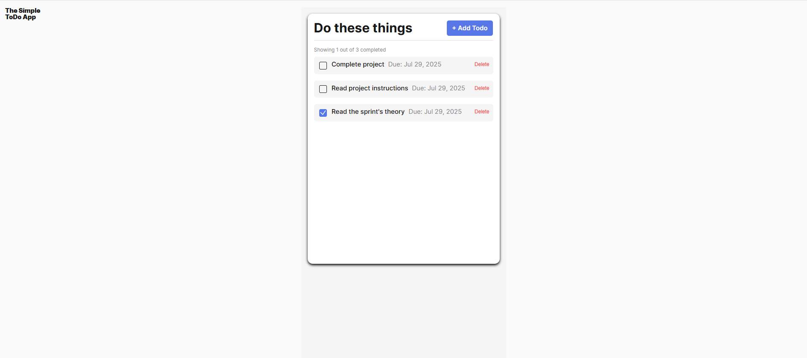

# Todo List Manager

A clean, interactive todo application built with JavaScript classes following Object-Oriented Programming principles. Manage your daily tasks with ease.

## Functionality

### Core Features
- ✅ Add new tasks with optional due dates
- ✔️ Mark tasks as complete/incomplete
- 🗑️ Delete tasks with confirmation
- 📊 Dynamic counter showing: `Showing X out of Y completed`
- 🚦 Form validation (minimum 2 characters required)

### Advanced Features
- 🪟 Modal popup with escape key and overlay click closing
- ♻️ Component-based architecture (6 independent classes)
- 🔗 Loosely coupled components communicating through events

## Technology

### Tech Stack

### Key Implementations
1. **OOP Architecture**
   - Todo (Manages individual items)
   - FormValidator (Form validation logic)
   - Popup/PopupWithForm (Modal window system)
   - Section (Rendering component)
   - TodoCounter (Stats tracking)

2. **Modern Techniques**
   - ES6 Class syntax
   - Module imports/exports
   - UUID generation for DOM elements
   - Event delegation

### Screenshots

## Deployment

This project is deployed on GitHub Pages:  
[Live Demo](https://zeryab-afk.github.io/se_project_todo-app/)

## Project Structure
